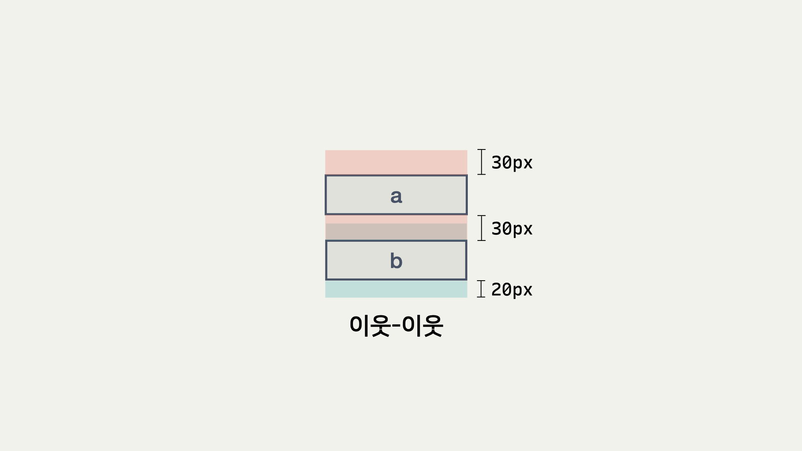
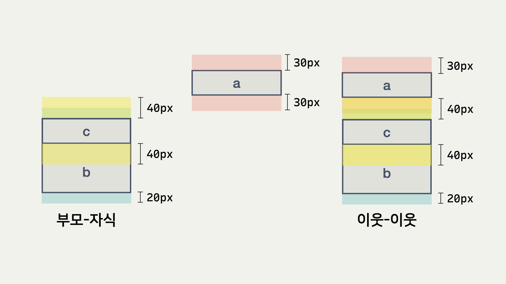

# css 핵심개념

작성일시: 2025년 6월 26일 오후 8:11
언어: css
수업날짜: 2025년 6월 27일

## css 선언(CSS Declaration)

```css
h3{
	color : #f3912;
}
```

## 선택자

id : 중복으로 사용 불가한 선택자. 특정 요소를 선택할 때 유용

```html
<p id="name">이름</p>
```

```css
#name {
  color: #fff;
}
```

class : 중복으로 사용 가능한 선택자. 여러 요소를 묶어서 선택할 때 유용

```html
<div class="box">hello</div>
<div class="box">world</div>
<div class="box">!!</div>
```

```css
.box {
  color: #fff;
  font-size: 16px;
  font-weight: 300;
}
```

## 색상 코드

#ff00ff : 16진수 코드

rgb(255, 0, 255) : rgb코드 

rgba(255, 0, 255, 0.5) : rgb코드 + 투명도

```html
  <span class="red">빨강</span>
  <span class="orange">주황</span>
  <span class="yellow">노랑</span>
```

```css
  .red {
    color: #F23030;
  }

  .orange {
    color: #F28705;
  }

  .yellow {
    color: #F2CB05;
  }

```

## 크기 단위

px : 화면을 표시하는 가장 작은 정사각형 단위, 모니터에 따라서 조금 다르게 보일 수 있다.

% : 부모태그에 대해서 상대적인 크기. 부모크기를 바꾸면 같이 변경됨.

em : 1em = 부모태그의 font-size. 부모태그가 16px일때 2em을 주면 32px를 가지게 됨

rem : 최상위 태그 <html>의 font-size가 기준. 

## 폰트 스타일링

line-height : 줄 높이, 줄과 줄 사이의 간격 조정.

```html
  <p class="loose">
    넓게<br>
    넓게<br>
    넓게
  </p>
  <p class="regular">
    보통<br>
    보통<br>
    보통
  </p>
  <p class="tight">
    좁게<br>
    좁게<br>
    좁게
  </p>
```

```css
  .loose {
    font-size: 16px;
    line-height: 1.7; /* 16px * 1.7 = 27.2px */
  }

  .regular {
    font-size: 16px;
    line-height: 1.5; /* 16px * 1.5 = 24px */
  }

  .tight {
    font-size: 16px;
    line-height: 1; /* 16px * 1 = 16px */
  }
```

text-decoration : 텍스트에 밑줄을 넣거나, 취소선을 넣음.

```html
  <a href="https://codeit.kr">
    링크
  </a>
  <br>
  <a class="none" href="https://codeit.kr">
    밑줄 없는 링크
  </a>
  <br>
  <span class="underline">
    밑줄
  </span>
  <br>
  <span class="line-through">
    취소선
  </span>
```

```css
  .none {
    text-decoration: none;
  }

  .underline {
    text-decoration: underline;
  }

  .line-through {
    text-decoration: line-through;
  }
```

## 배경 이미지 background-image

```css
background-image: url('flowers.png');

/* 여러개 넣을 수도 있음 */
background-image:
  url('a.png'), /* 제일 위에 보이는 이미지 */
  url('b.png'),
  url('c.png');
```

### 배경 이미지 위치 background-position

```css
background-position: top; /* 위 */
background-position: right; /* 오른쪽 */
background-position: bottom; /* 아래 */
background-position: left; /* 왼쪽 */
background-position: left top; /* 왼쪽 위 (지정하지 않았을 때 기본값) */
background-position: center;
```

### 배경 이미지 반복 background-repeat

```css
background-repeat: repeat; /* 반복하기 (지정하지 않았을 때 기본값) */
background-repeat: no-repeat; /* 반복 안 함 */
```

### 배경 이미지 크기 background-size

```css
background-size: cover; /* 비율 유지하면서 꽉 차게. 이미지 잘릴 수 있음 */
background-size: contain; /* 비율 유지하면서 최대한 크게. 이미지 잘리지 않음 */
background-size: 40px 30px; /* 가로 40px 세로 30px */
```

## 그라디언트 linear-gradient()

```css
background-image: linear-gradient(#000000, #ffffff);

background-image:
  linear-gradient(45deg, rgba(0, 0, 0, 0.8), rgba(0, 0, 0, 0.2));
```

 [gradient generator](https://cssgradient.io/)로 들어가면 쉽게 보면서 만들 수 있다.

## 그림자 box-shadow

```css
box-shadow: 5px 10px 15px 8px rgba(0, 0, 0, 0.6);
/*
  가로: 5px
  세로: 10px
  흐린 정도(Blur): 15px
  퍼지는 정도(Spread): 8px
  색상: rgba(0, 0, 0, 0.6)
*/
```

## 불투명도 opacity

```css
opacity: 0; /* 투명 */
opacity: 1; /* 불투명 */
```

opacity는 요소 전체를 불투명하게 만들기 때문에 배경만 불투명하게 만들기 위해서는 rgba()를 사용해야한다. 

## Box Model


### padding과 margin

padding은 영역 내부에 여백을 넣을 때 사용

```css
padding: 8px; /* 상하좌우 */
padding: 16px 8px; /* 상하, 좌우 */
padding: 16px 8px 24px; /* 상, 좌우, 하 */
padding: 16px 8px 24px 10px; /* 상, 우, 하, 좌 */
```

margin은 영역 외부에 여백을 넣을 때 사용

```css
margin: 8px; /* 상하좌우 */
margin: 16px 8px; /* 상하, 좌우 */

width: 520px; /* 반드시 너비가 정해져 있어야 자동으로 채울 수 있음 */
margin: 16px auto;

margin: 16px 8px 24px; /* 상, 좌우, 하 */
margin: 16px 8px 24px 10px; /* 상, 우, 하, 좌 */
```

### 테두리 border

```css
border: 2px solid #ededed;
border-radius: 16px;
border-radius: 50%;
```

### box-sizing : border-box

일반적으로 요소에 크기를 지정하면 content의 크기만 해당. 이 속성을 통해 border와 padding까지 포함해서 크기를 지정할 수 있다. 

```css
#box {
  margin: 20px;
  padding: 30px;
  width: 100px;
  box-sizing: border-box;
}
```

### overflow

박스의 크기를 지정했을때 넘치는 내용을 처리하는 속성

```css
overflow: hidden; /* 숨기기 */
overflow: auto; /* 넘치면 스크롤 */
overflow: scroll; /* 항상 스크롤 */
```

## 마진 상쇄(Margin Collapsing)

인접한 두 요소들 사이의 세로 마진은 상쇄될 수 있다. 부모요소와 자식요소 사이에서도 발생할 수 있다. 그러나 border나 padding으로 경계가 확실하면 일어나지 않는다.

인접한 태그

```html
<div id="a">a</div>
<div id="b">b</div>
```

```css
#a { margin: 30px; }
#b { margin: 20px; }
```



부모자식 태그 

```html
<div id="a">
  a
</div>
<div id="b">
  <div id="c">
    c
  </div>
  b
</div>
```

```css
#a {
  margin: 30px;
}
#b {
  margin: 20px;
}
#c {
  margin: 40px;
}
```



## 선택자(Selector)

CSS 규칙에서 맨 앞에 적어주는 것으로 html에서 요소를 선택하는 방법

```css
선택자 {
  선언;
  선언;
  선언;
}
```

### 그룹선택자

콤마(,)로 선택자를 연결하여 여러 선택자에 같은 규칙을 적용할 수 있다.

```css
선택자1,
선택자2 {
  ...
}
```

선택자 붙여쓰기

여러 조건을 동시에 만족하는 요소를 선택하고 싶다면 선택자를 붙여서 사용

```html
<h2 id="mongolia" class="large title">몽골 대자연으로 떠나는 여행</h2> 
```

```css
/*아이디+클래스*/
#mongolia.title{}

/*클래스+클래스*/
.large.title{}

/*태그+아이디+클래스*/
h2#mongolia.large.title{}
```

### 자식 결합자(Child Combinator)

“>”로 선택자를 이어준다 

```html
<div class="article">
  
  ...
</div>
```

```css
.article > img {
  width: 100%;
}
```

### 자손 결합자(Descendant Combinator)

스페이스(띄어쓰기)로 선택자를 이어 준다.

```html
<div class="article">
    <p> 이번에 리뷰해 볼 차량은 테슬라 모델 W 입니다.
      
  </p>
  ...
</div>
```

```css
.article img {
  width: 100%;
}
```

### 가상 클래스(Pseudo-class)

요소의 상태 같은 걸 선택할 때 사용하는 클래스. 정해진 이름 앞에 콜론(`:`)을 붙여서 사용.
`:hover`(마우스를 올렸을 때),  `:active`(클릭한 상태), `:visited`(방문한 적이 있는 링크), `:focus`(포커싱 됐을 때)

```css
a {
  text-decoration: none;
}

a:hover {
  text-decoration: underline;
}
```

### 전체 선택자(Universal Selector)

*는 모든 요소를 선택하는 선택자

```css
* {
  box-sizing: border-box;
}

/* .gallery의 모든 자식 요소를 선택 */
.gallery > * {
  width: 120px;
  height: 90px;
}
```

### n번째 자식 선택자(n-th child Selctor)

`:nth-child()`를 사용. 괄호 안에는 숫자나 `even`, `odd`, `2n` 같은 값이 들어갈 수 있다. 자식 순서는 “1”부터 시작. (첫 번째 자식은 1이고, 세 번째 자식은 3임)

```css
/* 3번째 자식 선택자 */
.gallery :nth-child(3) { ... }

/* 짝수번째 자식 선택자 */
.gallery :nth-child(even) { ... }
.gallery :nth-child(2n) { ... }

/* 홀수번째 자식 선택자 */
.gallery :nth-child(odd) { ... }
.gallery :nth-child(2n+1) { ... }

/* 첫번째 자식 선택자 */
.gallery :first-child { ... }

/* 마지막 자식 선택자 */
.gallery :last-child { ... }
```

## Casecade

css에서 적용되는 우선순위

브라우저 제공보다는 코드가 우선수위가 높고 코드들 중에서는 나중에 적힌 것이 개발자도구로 직접 작성하면 우선순위가 가장 높음.

specificity 선택자의 명시도

명시도가 높을 수록 우선순위가 높음 선택자가 복잡 할 수록 명시도가 높아진다.

## 상속

inherited from이 상속된 속성이다.
