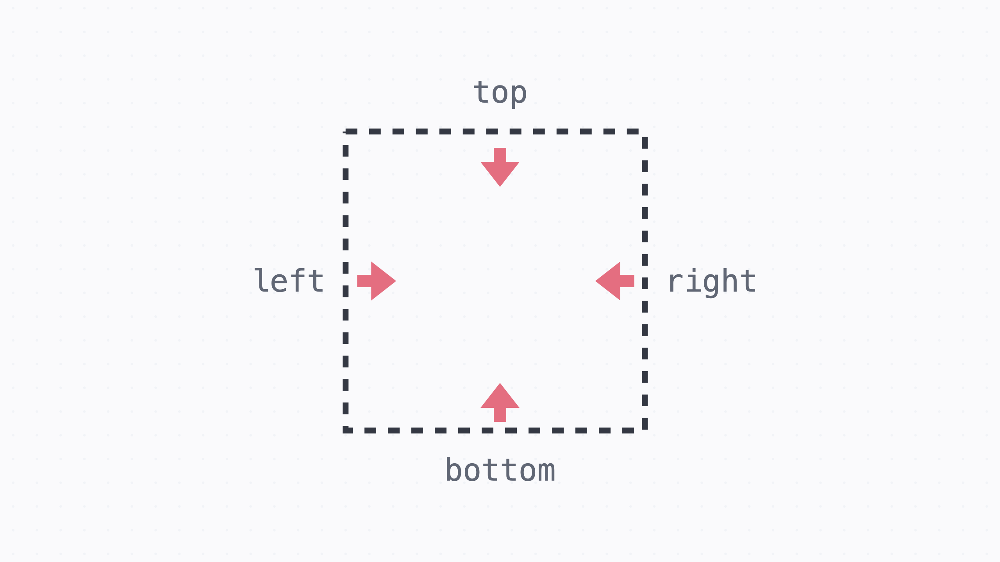
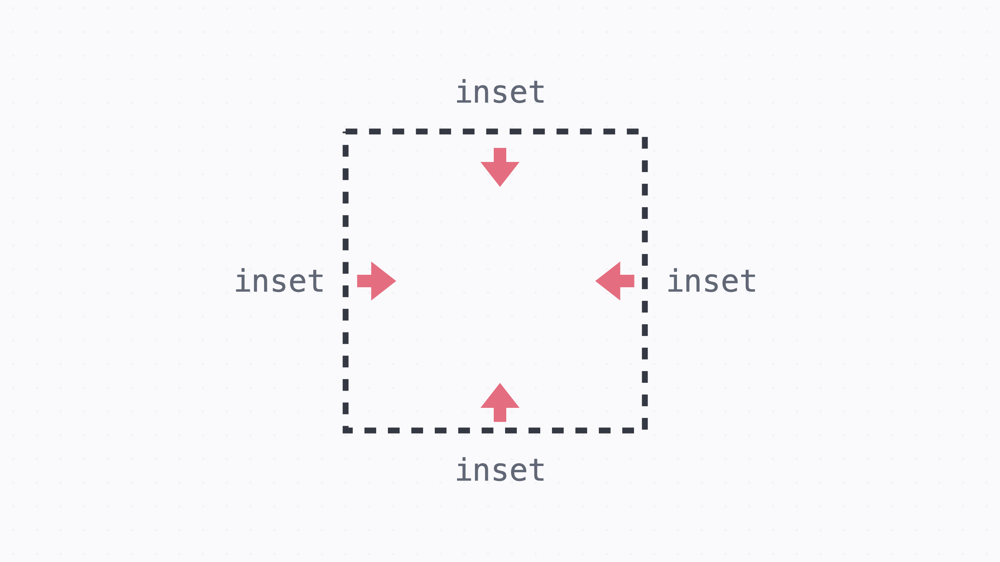
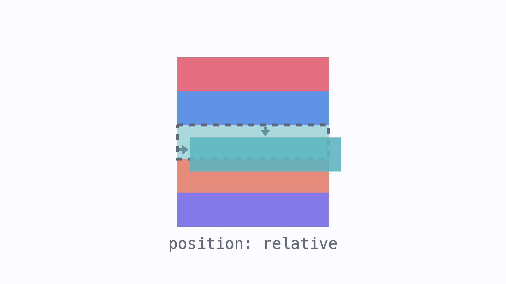
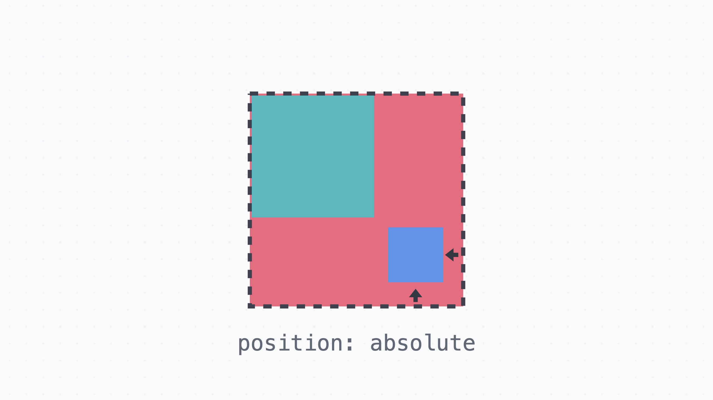
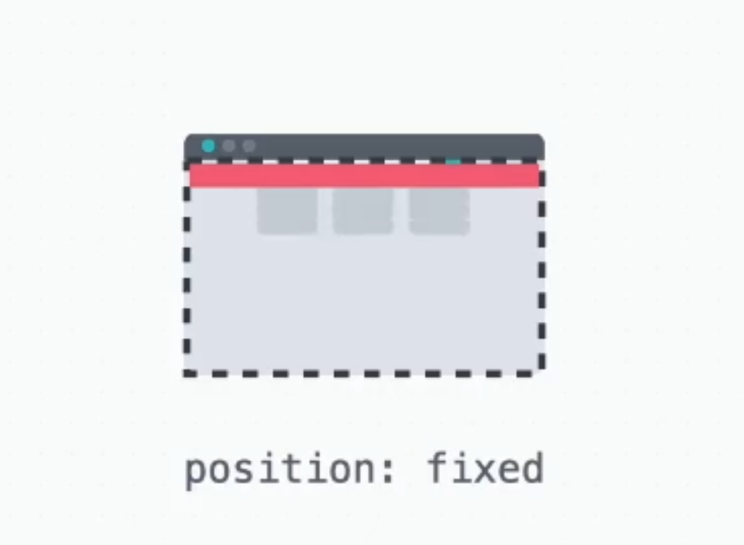
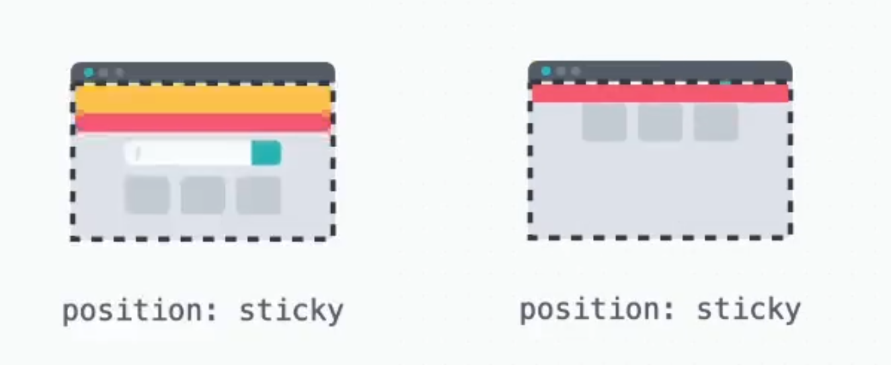
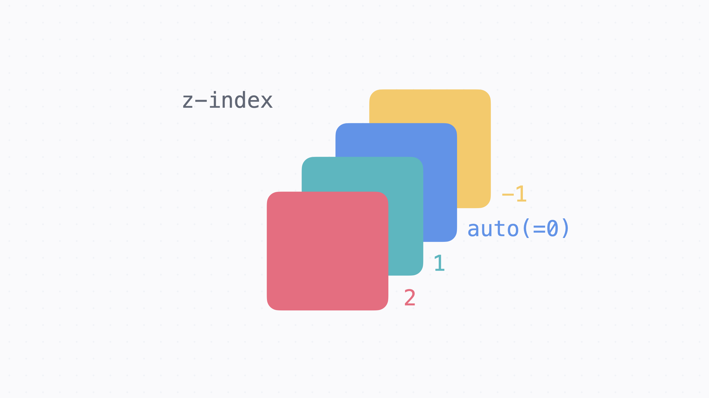

# css layout(position)

작성일시: 2025년 6월 30일 오후 3:30
언어: css
키워드: #css #layout #position
수업날짜: 2025년 6월 30일

## position 속성

글의 흐름에서 벗어나 요소를 자유롭게 배치할때 쓰는 속성. default value는 static으로 원래 있어야할 위치에 배치된다. 

---

## 위치

위치를 정하는 기준에 대해서 top, right, bottom, left 속성으로 위치를 정할 수 있다.



모든 방향에서 같은 값이 주어질때는 **inset**속성을 사용한다.



## position: relative;

요소의 **원래 위치를 기준**으로 배치. 이때 **요소의 원래 자리는 그대로 차지**하고 있다. 



```css
.green {
  position: relative;
  top: 15px;
  left: 10px;
}
```

## position: absolute;

**포지셔닝이 된 가장 가까운 조상 요소를 기준**으로 배치. 포지셔닝이 되었다는 건 static이 아니라는 의미. 요소의 원래 자리를 차지하지 않는다. 



```css
.red { /*포지셔닝 된 가장 가까운 조상*/
  position: relative;
  top: 0;
  left: 10px;
}

.blue {
  position: absolute;
  right: 10px;
  bottom: 15px;
}
```

## position: fixed;

**브라우저 화면을 기준으로 고정된 배치**. 요소의 원래 자리를 차지하지 않는다. 



```css
.red {
  position: fixed;
  /* 브라우저 화면 상단에 고정 */
  top: 0;
  left: 0;
  width: 100%;
}
```

## position: sticky;

static처럼 **원래 위치에 배치되어 있다가 정해진 위치에 브라우저가 스크롤 되면** 그때부터 fixed처럼 고정되어 배치. static처럼 배치되기 때문에 **요소의 원래자리를 차지**. 



```css
/* 원래 위치에 있다가 브라우저 상단에 스크롤 될때 상단에 고정된다. */
.red {
  position: sticky;
  top: 0;
  left: 0;
  width: 100%;
}
```

## position 정리

|  | relative | absolute | fixed | **sticky** |
| --- | --- | --- | --- | --- |
| 기준 | 원래 요소 자리 | 포지셔닝 된 가장 가까운 조상 | 브라우저 | 브라우저 |
| 고정 | x | x | o | 위치될때 고정  |
| 원래 자리 차지 | o | x | x | o |

## z-index

앞뒤 순서를 정할 때 쓰는 값. 값이 높을수록 화면에 보여지는 우선순위가 높다. 



---

## review.

### 오늘 배운 것 요약

- position 속성은 요소를 배치할 때 사용하는 속성.
- 특정 요소를 기준으로 배치를 할때는 relative(기준)와 absolute를 사용
- 브라우저를 기준으로 고정할 때는 fixed를 사용
- 스크롤 중에 고정하고 싶을 때는 sticky를 사용

### 느낀 점

position을 사용할 때 relative에 대한 이해가 없이 사용했다는 것을 깨달았다.  absolute의 기준점으로서 부모요소에 마구잡이로 사용했었는데 relative는 요소의 원래 위치를 기준으로 배치된다는 것을 알 수 있었다. 

sticky를 사용하면 js 없이 문제를 해결할 수 있었다. 훨씬 간단하고 알아보기 쉽게 css를 구성할 수 있었다.
