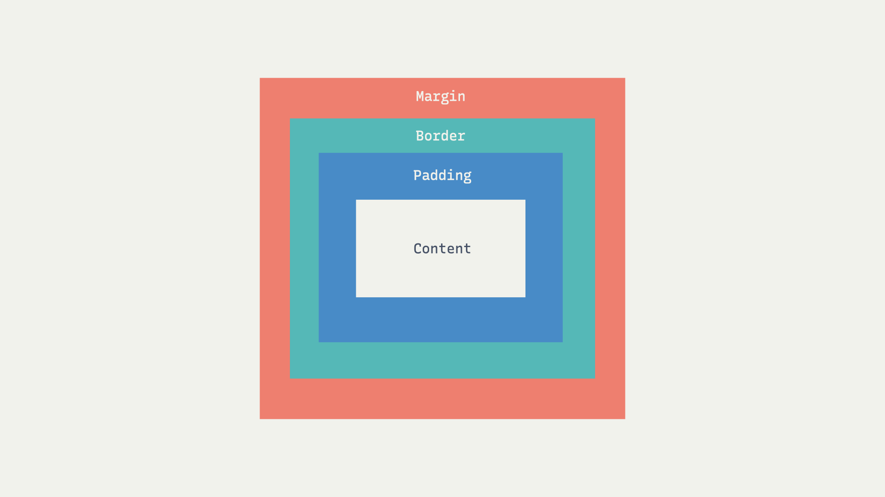

# css layout(grid)

작성일시: 2025년 7월 1일 오후 3:21
언어: css
키워드: #css #layout #grid
수업날짜: 2025년 7월 2일

## Grid

flex와 같이 요소를 배치하는 방식. 1차원 배열인 flex와 달리 2차원 배열 방식.

- grid-template : grid 내부 행(row)와 열(column) 크기 지정
- gird-column, grid-row : 요소의 grid 위치 배치
- grid-area + grid-template-areas : 이름으로 grid 위치 배치

---

### grid-template-rows / grid-template-columns

grid의 행(row)과 열(columns)의 크기를 지정한다.

```css
display: grid;
grid-template-rows: 300px 300px;
grid-template-columns: 100px 200px 100px;

/*   | 100px |   200px   | 100px | 
		 ------------------------------
		 | 100px |   200px   | 100px |
*/
grid-template: 300px 300px / 100px 200px 100px
/* row와 coloumn을 한번에 작성할 수도 있다. */
```

### 유연한 크기 단위 fr

fr이라는 단위를 사용하면 flexbox처럼 전체 크기에 대해 상대적인 크기 지정 가능. 

```css
display: gird;
grid-template-columns: 1fr 1fr 1fr; /* column이 1:1:1로 grid 생성*/
```

### repeat 함수

반복되는 값을 처리하는 함수 

**repeat(반복횟수, 반복값)**

```css
grid-template-columns: repeat( 3, 1fr); 
```

### minmax 함수

최솟값과 최댓값을 지정하는 함수

**minmax(최소값, 최대값)**

```css
grid-template-columns: repeat( 3, minmax(200px, 1fr));
/* 최소 200px인 3개의 column을 생성, 화면 너비가 넓어지면 1:1:1 비율로 늘어난다. */
```

### gap

grid도 flex처럼 gap으로 셀의 간격을 설정할 수 있다. 

```css
row-gap: 10px /* row 간격 10px */
column-gap: 30px /* colunm 간격 30px */

gap: 10px 30px /* 한번에 쓰면 row colunm 순으로 간격 적용*/

gap: 10px; /* row, column 모두 간격 10px */
```

### 원하는 위치에 셀 배치

### 그리드 라인 번호




column은 왼쪽부터 1,2,… row는 위에서부터 1,2… 순서로 번호가 붙어있다. 역순의 경우 -로 표기. 이 라인을 기준으로 셀을 배치할 수 있다.

```css
gird-column: 2/4; /* gird column 라인 2번부터 4번까지 배치*/ 
gird-row: 1/3; /* gird row 라인 1번부터 3번까지 배치*/ 

gird-row: 1/-1 /* 음수도 사용 가능 */

/* span을 사용하면 시작지점부터 몇칸을 차지할 지 표시. */
gird-column: 2/span 2  /* column 라인 2부터 2칸을 차지 */
```

### 요소 이름

grid-area로 영역에 이름을 정의하고 grid-template-areas로 이름을 사용해 배치 할 수 있다. 셀을 비우고 싶다면 . 을 사용. 복잡한 배치는 코드에서 형태를 확인할 수 있다는 장점이다. 

```css
.grid-box{
	display: grid;
	grid-template: repeat(3, 1fr) / repeat(2, 1fr);
	
	grid-template-areas:
		's1 s2'
		's1 s2'
		's3 s3';
}

.shell1{
	grid-area: s1;
}
.shell2{
	grid-area: s2;
}
.shell3{
	grid-area: s3;
}
```

## 요소들의 정렬 - container 적용

shell들의 정렬 방법 flexbox와 유사하다 

### 세로 방향 정렬 align-items

아이템들은 column축 방향으로 정렬 

```css
.grid-box{
	align-items: steretch;
	/* align-items: start; */
	/* align-items: center; */
	/* align-items: end; */
}
```

### 가로 방향 정렬 justify-items

아이템들은 row축 방향으로 정렬 

```css
.grid-box{
	justify-items: stretch;
	/* justify-items: start; */
	/* justify-items: center; */
	/* justify-items: end; */
}
```

### 동시 정렬 place-items

column축과 row축 정렬을 동시에 작성할 수 있는 속성. align-items, justify-items 순서로 작성, 하나만 쓰면 두 속성 모두에 적용.

```css
.grid-box{
	place-items: center start; /* align-items: center;  justify-items: start; */
}
```

## shell 정렬 - container 적용

grid shell들을 모두 합한 값이 grid contatiner보다 작을때 shell들을 통째로 정렬하는 방법. 요소들의 정렬은 각 shell 내용들이 정렬되지만 이 정렬을 사용하면 shell이 통째로 정렬이 된다. 

### 세로 방향 정렬 align-content

아이템들은 column축 방향으로 정렬 

```css
.grid-box{
	align-content: stretch;
	/* align-content: start; */
	/* align-content: center; */
	/* align-content: end; */
	/* align-content: space-between; */
	/* align-content: space-around; */
	/* align-content: space-evenly; */
}
```

### 가로 방향 정렬 justify-content

아이템들은 column축 방향으로 정렬 

```css
.grid-box{
	justify-content: stretch;
	/* justify-content: start; */
	/* justify-content: center; */
	/* justify-content: end; */
	/* justify-content: space-between; */
	/* justify-content: space-around; */
	/* justify-content: space-evenly; */
}
```

### 동시 정렬 place-content

items와 동일하게 align-content, justify-content 순서로 작성, 하나만 쓰면 두 속성 모두에 적용.

```css
.grid-box{
	place-content: space-between center;
}
```

## 개별 내용 정렬 - item 적용

적용된 아이템만 정렬됨

### 세로 방향 정렬 align-self

아이템을 column축 방향으로 정렬 

```css
.grid-box{
	align-self: stretch;
	/* align-self: start; */
	/* align-self: center; */
	/* align-self: end; */
}
```

### 세로 방향 정렬 justify-self

아이템을 row축 방향으로 정렬 

```css
.grid-box{
	justify-self: stretch;
	/* justify-self: start; */
	/* justify-self: center; */
	/* justify-self: end; */
}
```

### 동시 정렬 place-self

align-self, justify-self순서로 작성, 하나만 쓰면 두 속성 모두에 적용.

```css
.grid-box{
	place-self: start center;
}
```

---

## review.

### 오늘 배운 것 요약

- 2차원으로 요소를 배치하기 위한 속성
- grid의 column과 row의 크기를 설정할 수 있고 유연한 크기도 설정이 가능하다.
- 원하는 위치에 요소를 배치할 수 있다.
- grid의 다양한 정렬 방식이 있다. 모든 요소, shell 전체, 특정 요소에 원하는 정렬 방식을 사용할 수 있다.

### 느낀 점

1차원 배치인 flexbox와 달리 grid를 이용하면 2차원 배치를 할때 매우 유용해 보인다. flexbox를 쓰면 여러개의 box를 사용해야할 배치도 grid를 이용한다면 하나로 배치가 가능해 코드를 훨씬 깔끔히 작성할 수 있을듯하다.